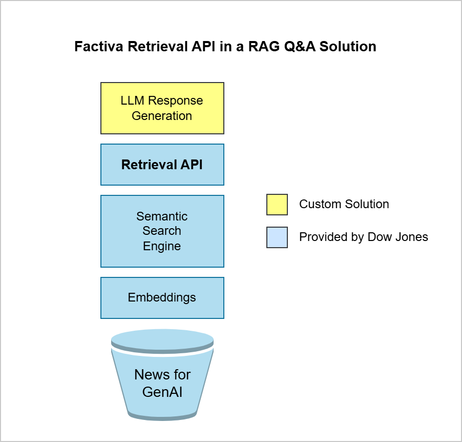

# Factiva Retrieval API - Getting Started
This repository contains a set of Jupyter Notebooks and other assets that walk through the use of the Factiva Retrieval API service offered by Dow Jones.

## Prerequisites
The notebooks in this repository rely on packages specified in the `requirements.txt` file. If seeting up a new Python environment, please run:

```bash
$ pip install -r requirements.txt
```

## Factiva Retrival API Overview
This service provides the retrieval functionality that returns news articles as part of the trusted data sources in a RAG stack. This is an intermediate step in a fully grounded Question-Answer solution based on LLMs.

<div align="center"></div>

## Where to start?
The notebook [1_get_chunks](1_get_chunks.ipynb) shows the step by step process of retrieving content and process an answer using Google Gemini by consuming a Google Cloud Vertex AI endpoint.
